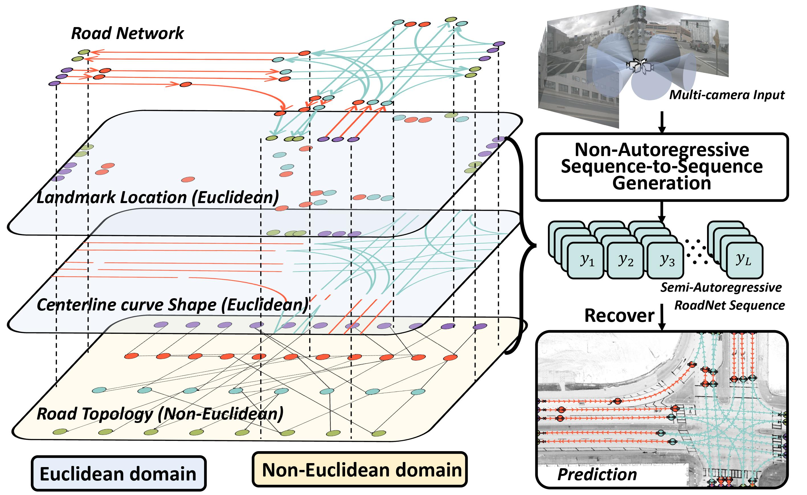

# Road Network and Lnae Topology Extraction

> **ICCV 2023 (Oral)** [**Translating Images to Road Network: A Non-Autoregressive Sequence-to-Sequence Approach**](https://arxiv.org/abs/2402.08207),            
> Jiachen Lu, Renyuan Peng, Xinyue Cai, Hang Xu, Hongyang Li, Feng Wen, Wei Zhang, [Li Zhang](https://lzrobots.github.io)  
> **Fudan University, Huawei Noah’s Ark Lab, Shanghai AI Lab**

> **AAAI 2024** [**LaneGraph2Seq: Lane Topology Extraction with Language Model via Vertex-Edge Encoding and Connectivity Enhancement**](https://arxiv.org/abs/2401.17609),            
> Renyuan Peng, Xinyue Cai, Hang Xu, Jiachen Lu, Feng Wen, Wei Zhang, [Li Zhang](https://lzrobots.github.io)  
> **Fudan University, Huawei Noah’s Ark Lab**



## Release Announcement
- **April 16, 2024**: The latest stable release of RNTR, based on Torch 1.8.1, is now available. This version resolves the issue of slow dataloader performance, with average training times now reduced to four days.  It is important to mention that without Torch 2.0, the efficiency of Transformers might be compromised. This could result in decreased performance and increased memory usage. For future updates, we plan to introduce the following enhancements:
  - Implementation of LaneGraph2Seq on Torch 1.8.1
  - Support for FP16 training
  - Availability of trained checkpoints
  - Enhanced visualization tools

## Torch < 2.0 (Stable Version) Get Started
Please checkout for [get_started.md](RoadNetwork-1.8.1/get_started.md)
The base path will be `RoadNet/RoadNetwork-1.8.1/`
## Pre-training
```
./tools/dist_train.sh projects/configs/road_seg/lss_roadseg_48x32_b4x8_resnet_adam_24e.py 8
```
Move the final checkpoint to `ckpts/`
```
cp work_dirs/lss_roadseg_48x32_b4x8_resnet_adam_24e/latest.pth ckpts/lss_roadseg_48x32_b4x8_resnet_adam_24e.pth
```
## Training
For ICCV: Translating Images to Road Network: A Non-Autoregressive Sequence-to-Sequence Approach
```
./tools/dist_train.sh projects/configs/rntr_ar_roadseq/lss_ar_rntr_l6_d256_gpu2x8.py 8
```

## Torch >= 2.1 (Efficient Version) Get Started
Please checkout for [get_started.md](RoadNetwork-2.0.1/get_started.md)
## Pre-training
```
./tools/dist_train.sh RoadNetwork/configs/road_seg/lss_roadseg_48x32_b4x8_resnet_adam_24e.py 8
```
Move the final checkpoint to `ckpts/`
```
cp work_dirs/lss_roadseg_48x32_b4x8_resnet_adam_24e/last_checkpoint ckpts/lss_roadseg_48x32_b4x8_resnet_adam_24e.pth
```
## Training
For ICCV: Translating Images to Road Network: A Non-Autoregressive Sequence-to-Sequence Approach
```
./tools/dist_train.sh projects/RoadNetwork/configs/rntr_ar_roadseg/lss_ar_rntr_changeloss_test_fp16_torch2.py 8
```
For AAAI: LaneGraph2Seq: Lane Topology Extraction with Language Model via Vertex-Edge Encoding and Connectivity Enhancement
```
./tools/dist_train.sh projects/RoadNetwork/configs/lanegraph2seq/langraph2seq_fp16_torch2.py 8
```

## Acknowledgements
We thank numerous excellent works and open-source codebases:
- [MMDetection3D](https://github.com/open-mmlab/mmdetection3d)
- [PETR](https://github.com/megvii-research/PETR)
- [DETR3D](https://github.com/WangYueFt/detr3d)
- [BEVDet](https://github.com/HuangJunJie2017/BEVDet)

## 📜 BibTex

```bibtex
@inproceedings{lu2023translating,
  title={Translating Images to Road Network: A Non-Autoregressive Sequence-to-Sequence Approach},
  author={Lu, Jiachen and Peng, Renyuan and Cai, Xinyue and Xu, Hang and Li, Hongyang and Wen, Feng and Zhang, Wei and Zhang, Li},
  booktitle={Proceedings of the IEEE/CVF International Conference on Computer Vision},
  pages={23--33},
  year={2023}
}
```


```bibtex
@inproceedings{peng2024lanegraph2seq,
  title={LaneGraph2Seq: Lane Topology Extraction with Language Model via Vertex-Edge Encoding and Connectivity Enhancement},
  author={Peng, Renyuan and Cai, Xinyue and Xu, Hang and Lu, Jiachen and Wen, Feng and Zhang, Wei and Zhang, Li},
  booktitle = {AAAI Conference on Artificial Intelligence (AAAI)},
  year={2024}
}
```
